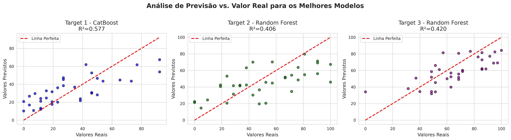

# 📊 Documentação do projeto

**Propósito do Projeto**

<small>

Este projeto foi desenvolvido para realizar um ciclo completo de análise de dados, desde a limpeza e preparação até a modelagem preditiva e avaliação de performance. O objetivo principal é transformar um conjunto de dados brutos de jogadores em insights acionáveis e modelos de _machine learning_ robustos, capazes de prever três métricas-alvo distintas (`Target1`, `Target2` e `Target3`).

O processo é dividido em duas fases principais:

1.  **Fase de Limpeza e Preparação (V1)**: Focada em garantir a qualidade e a consistência dos dados. Nesta etapa, são aplicadas técnicas como tratamento de valores ausentes, remoção de _outliers_, _feature engineering_ e seleção de variáveis para criar um _dataset_ otimizado e confiável.

2.  **Fase de Modelagem (V2)**: Utiliza o _dataset_ limpo para treinar, avaliar e comparar diversos algoritmos de regressão, como _Random Forest_, _XGBoost_ e _LightGBM_. O objetivo é identificar os modelos com melhor desempenho para cada uma das variáveis-alvo, salvando-os para futura implementação em produção.

Ao final, o projeto entrega não apenas os modelos treinados, mas também análises visuais e relatórios que facilitam a interpretação dos resultados e a identificação das variáveis mais influentes.

</small>

<details>

<summary> 📊 Fase V1 - Limpeza</summary>

### 🧩 **Célula 1/2 - Configuração do Ambiente e Importações**

<small>
📖 Explicação:

Esta célula inicializa o ambiente de trabalho. Primeiro, realiza a instalação silenciosa das dependências externas necessárias para a manipulação de planilhas e para a aplicação de técnicas de aprendizado de máquina. Em seguida, importa as bibliotecas e módulos que serão utilizados ao longo das etapas de limpeza, transformação e análise de dados.

<details>

<summary> Bibliotecas utilizadas: </summary>

<small>

- **xlsxwriter e openpyxl**:

Dependências utilizadas pelo Pandas para ler e escrever arquivos no formato Excel (.xlsx). A instalação garante a compatibilidade com essas operações.

- **scikit-learn**:

Uma das principais bibliotecas de aprendizado de máquina em Python, que fornece ferramentas eficientes para pré-processamento, modelagem e avaliação de dados.

- **pandas**:

Fundamental para a manipulação e análise de dados. É utilizada para carregar os dados em estruturas conhecidas como DataFrames, que facilitam a limpeza e a transformação.

- **numpy**:

Essencial para computação numérica, oferece suporte a arrays e matrizes multidimensionais, além de uma vasta coleção de funções matemáticas de alto desempenho.

- **SimpleImputer**:

Uma classe do Scikit-learn usada para tratar dados ausentes (NaN), permitindo preenchê-los com uma estratégia definida (como a média, mediana ou a moda da coluna).

- **StandardScaler**:

Uma classe do Scikit-learn utilizada para padronizar as features numéricas, redimensionando-as para que tenham média zero e desvio padrão igual a um, o que é crucial para muitos algoritmos de machine learning.

- **datetime**:

Módulo padrão do Python para manipulação de datas e horas.

- **warnings**:

Módulo para controlar a exibição de mensagens de aviso. A linha warnings.filterwarnings('ignore') é usada para suprimir esses avisos e manter a saída do código mais limpa e focada nos resultados.
</small>

</details>

---

### 🧩 **Célula 3 - DEFINIÇÕES**

<details>

<summary> Trecho do codigo em Python </summary>

```python
COLUNAS_CATEGORICAS = [
    'Cor0202', 'Cor0204', 'Cor0206', 'Cor0208', 'Cor0209Outro',
    'P01', 'P02', 'P03', 'P04', 'P05', 'P07', 'P08', 'P09', 'P10',
    'P12', 'P13', 'P15', 'P12_1', 'P02_1', 'P03_1', 'P09_1'
]

COLUNAS_TARGETS = ['Target1', 'Target2', 'Target3']

COLUNAS_IGNORAR = [
    'Código de Acesso', 'Data/Hora Último',
    'L0210 (não likert)',
    'F0299 - Explicação Tempo', 'T0499 - Explicação Tempo',
    'PTempoTotalExpl', 'T1199Expl', 'T1205Expl', 'T1210Expl',
    'TempoTotalExpl'
]

print(f"📋 Categóricas: {len(COLUNAS_CATEGORICAS)} | Targets: {len(COLUNAS_TARGETS)}")
```

</details>
<small> 📖 Explicação:

Esta célula centraliza as **definições estruturais** do dataset, classificando as colunas em grupos conforme seu papel no processamento:

- **`COLUNAS_CATEGORICAS`**: lista de variáveis qualitativas ou de múltipla escolha, normalmente representadas por códigos (`P01`, `P02`, etc.).
- **`COLUNAS_TARGETS`**: define as variáveis-alvo (targets) utilizadas em análises ou modelagem.
- **`COLUNAS_IGNORAR`**: contém variáveis irrelevantes ou auxiliares, como identificadores, timestamps e campos descritivos.
  </small>

---

### 🧩 **Célula 4 - Carregando Dataset Recebido**

<details>

<summary> Trecho do codigo em Python </summary>

```python
import pandas as pd

df_original = pd.read_excel('JogadoresV1.xlsx')
df = df_original.copy()
print(f"Dados carregados: {df.shape[0]} linhas, {df.shape[1]} colunas")
```

</details>
<small>
📖 Explicação:

Nesta célula, realizamos a leitura do arquivo Excel contendo o dataset bruto e criamos uma cópia para preservar o original.

- `pd.read_excel()` carrega o arquivo no formato Excel.
- `.copy()` evita modificações acidentais no dataset original.  
  </small>

---

### 🧩 **Célula 5 - TRATAMENTO F0103**

<details>

<summary> Trecho do codigo em Python </summary>

```python
if 'F0103' in df.columns and df['F0103'].dtype == 'object':
    print("\n🔧 Convertendo F0103 (vírgula → ponto)")
    df['F0103'] = df['F0103'].str.replace(',', '.').astype(float)
    print("   ✅ Convertido!")
```

</details>

<small> 📖 Explicação:

Nesta célula, corrigimos a coluna chamada `F0103` para garantir que os números estejam em um formato que o Python consegue entender corretamente.

- Primeiro verificamos se a coluna `F0103` existe na tabela e se ela está como texto.

- Em seguida, substituímos todas as vírgulas `,` por pontos `.` — isso é importante porque em alguns arquivos, números decimais vêm escritos como `3,14` em vez de `3.14`.
- Por fim, transformamos essa coluna em números de ponto flutuante (`float`), para que possa ser usada em cálculos, análises e modelos sem causar erros.

Esse passo garante que a informação da coluna `F0103` seja precisa e utilizável em todas as etapas seguintes do processamento de dados.
</small>

---

### 🧩 **Célula 6 — REMOÇÃO DE NEGATIVOS**

<details>

<summary> Trecho do codigo em Python </summary>

```python
print("\n" + "=" * 80)
print("ETAPA 1: REMOÇÃO DE NEGATIVOS → NaN")
print("=" * 80)

colunas_numericas = df.select_dtypes(include=[np.number]).columns.tolist()
colunas_numericas = [col for col in colunas_numericas if col not in COLUNAS_TARGETS]

contador = 0
for col in colunas_numericas:
    negativos = (df[col] < 0).sum()
    if negativos > 0:
        df.loc[df[col] < 0, col] = np.nan
        contador += negativos

print(f"✅ {contador} negativos convertidos → NaN")

```

</details>

<small> 📖 Explicação:

Nesta célula, identificamos todas as colunas numéricas e substituímos valores negativos por valores vazios (NaN).

- Primeiro, usamos `df.select_dtypes(include=[np.number])` para selecionar todas as colunas que contêm números.

- Em seguida, removemos da lista as colunas-alvo definidas em `COLUNAS_TARGETS`, pois essas não devem ser modificadas nesse passo.

- Para cada coluna numérica restante, verificamos quantos valores são negativos usando `(df[col] < 0).sum()`.

- Quando valores negativos são encontrados, usamos `df.loc[df[col] < 0, col] = np.nan` para substituí-los.

- Ao final, imprimimos a quantidade total de valores negativos convertidos.

</small>

---

### 🧩 **Célula 7 - Remoção de Colunas com Muito Missing**

<details>

<summary> Trecho do codigo em Python </summary>

```python
print("\n" + "=" * 80)
print("ETAPA 2: ANÁLISE DE MISSING")
print("=" * 80)

missing_info = pd.DataFrame({
    'Coluna': df.columns,
    'Missing': df.isna().sum(),
    'Percentual': (df.isna().sum() / len(df) * 100).round(2)
})
missing_info = missing_info[missing_info['Missing'] > 0].sort_values('Percentual', ascending=False)

threshold = 70
colunas_remover = missing_info[missing_info['Percentual'] > threshold]['Coluna'].tolist()

if colunas_remover:
    print(f"🗑️  Removendo {len(colunas_remover)} colunas (>{threshold}% missing)")
    df = df.drop(columns=colunas_remover)

print(f"✅ Shape: {df.shape}")

```

</details>

<small> 📖 Explicação:

Nesta célula, realizamos uma análise de dados faltantes (`missing values`) em cada coluna e removemos aquelas que possuem um percentual alto de ausência de dados.

- Usamos `df.isna().sum()` para contar quantos valores estão faltando em cada coluna.

- Calculamos o percentual de valores faltantes dividindo pela quantidade total de linhas (`len(df)`).

- Criamos o DataFrame `missing_info`, que contém o nome da coluna, quantidade de valores ausentes e percentual de ausência.

- Ordenamos `missing_info` pelo percentual de ausência em ordem decrescente para focar nas colunas com mais dados faltantes.

- Definimos um limite (`threshold`) de 70%. Isso significa que qualquer coluna com mais de 70% de valores faltantes será removida.

- Usamos `df.drop(columns=colunas_remover)` para eliminar essas colunas do dataset.

- Por fim, imprimimos quantas colunas foram removidas e o novo formato da tabela (`df.shape`).

</small>

---

### 🧩 **Célula 8 - Remoção de Jogadores sem Targets**

<details>

<summary> Trecho do codigo em Python </summary>

```python
print("\n" + "=" * 80)
print("ETAPA 3: REMOÇÃO DE JOGADORES SEM TARGETS")
print("=" * 80)

antes = len(df)
df = df.dropna(subset=COLUNAS_TARGETS, how='all')
depois = len(df)

print(f"✅ Jogadores mantidos: {depois} (removidos: {antes-depois})")

```

</details>

<small> 📖 Explicação:

Nesta célula, garantimos que todos os registros (linhas) do dataset contenham pelo menos uma informação nos campos-alvo definidos em `COLUNAS_TARGETS`.

- Usamos `len(df)` para contar quantas linhas existem antes da limpeza (antes).

- O comando `df.dropna(subset=COLUNAS_TARGETS, how='all')` remove todas as linhas em que todos os campos de target estejam vazios (`NaN`).

- Calculamos novamente o tamanho do dataset (`depois`) para saber quantos registros restaram.

- Imprimimos a quantidade de jogadores mantidos e removidos após o filtro.

</small>

---

### **🧩 Célula 9 - Imputação de Valores Faltantes**

<details>

<summary> Trecho do codigo em Python </summary>

```python
# Numéricas: MEDIANA
colunas_num_imputar = [
    col for col in df.select_dtypes(include=[np.number]).columns
    if col not in COLUNAS_TARGETS and col not in COLUNAS_IGNORAR
]

if colunas_num_imputar:
    imputer_num = SimpleImputer(strategy='median')
    df[colunas_num_imputar] = imputer_num.fit_transform(df[colunas_num_imputar])
    print(f"✅ {len(colunas_num_imputar)} numéricas imputadas (mediana)")

# Categóricas: MODA
colunas_cat_imputar = [col for col in COLUNAS_CATEGORICAS if col in df.columns]

if colunas_cat_imputar:
    imputer_cat = SimpleImputer(strategy='most_frequent')
    df[colunas_cat_imputar] = imputer_cat.fit_transform(df[colunas_cat_imputar])
    print(f"✅ {len(colunas_cat_imputar)} categóricas imputadas (moda)")


```

</details>

<small> 📖 Explicação:

Nesta célula, tratamos os valores faltantes no dataset usando imputação — ou seja, substituímos valores ausentes (`NaN`) por valores calculados com base nos dados disponíveis.

- Colunas numéricas:

  - Identificamos todas as colunas numéricas usando `df.select_dtypes(include=[np.number])`.

  - Removemos as colunas-alvo (`COLUNAS_TARGETS`) e as colunas marcadas para ignorar (`COLUNAS_IGNORAR`).

  - Criamos um imputador (`SimpleImputer`) usando a estratégia `median` para substituir valores ausentes pela mediana daquela coluna.

  - Aplicamos a imputação usando `fit_transform`.

- Colunas categóricas:

  - Identificamos as colunas categóricas presentes (`COLUNAS_CATEGORICAS`).

  - Criamos um imputador usando a estratégia `most_frequent` para substituir valores ausentes pelo valor mais frequente da coluna (moda).

  - Aplicamos a imputação usando fit_transform.

</small>

---

### **🧩 Célula 10 - Tratamento de Outliers (IQR + Mediana)**

<details>

<summary> Trecho do codigo em Python </summary>

```python
colunas_outliers = [
    col for col in colunas_num_imputar
    if col not in ['QtdHorasSono', 'QtdHorasDormi', 'Acordar']
]

outliers_tratados = 0
for col in colunas_outliers:
    Q1 = df[col].quantile(0.25)
    Q3 = df[col].quantile(0.75)
    IQR = Q3 - Q1

    limite_inf = Q1 - 1.5 * IQR
    limite_sup = Q3 + 1.5 * IQR

    outliers_mask = (df[col] < limite_inf) | (df[col] > limite_sup)
    n_outliers = outliers_mask.sum()

    if n_outliers > 0:
        mediana = df[col].median()
        df.loc[outliers_mask, col] = mediana
        outliers_tratados += n_outliers

print(f"✅ {outliers_tratados} outliers tratados (substituídos por mediana)")

```

</details>

<small> 📖 Explicação:

Nesta célula, detectamos e tratamos outliers — valores extremos que podem distorcer análises e modelos — utilizando o método do Intervalo Interquartílico (IQR) e substituindo-os pela mediana da coluna.

- Primeiro identificamos as colunas numéricas a serem tratadas (`colunas_outliers`), excluindo colunas específicas como `QtdHorasSono`, `QtdHorasDormi` e `Acordar`.

- Para cada coluna:

  - Calculamos o **primeiro quartil** (`Q1`) e o **terceiro quartil** (`Q3`).

  - Determinamos o **Intervalo Interquartílico (IQR)** como `Q3 - Q1`.

  - Definimos limites inferior (`limite_inf`) e superior (`limite_sup`) como `Q1 - 1.5*IQR` e `Q3 + 1.5*IQR`, respectivamente.

  - Criamos uma máscara (`outliers_mask`) identificando valores fora desses limites.

  - Quando outliers são encontrados, substituímos esses valores pela mediana da coluna.

  - Contabilizamos quantos outliers foram tratados.

</small>

---

### **🧩 Célula 11 - One-Hot Encoding**

<details>

<summary> Trecho do codigo em Python </summary>

```python
colunas_cat_presentes = [col for col in COLUNAS_CATEGORICAS if col in df.columns]

if colunas_cat_presentes:
    colunas_antes = df.shape[1]
    df = pd.get_dummies(df, columns=colunas_cat_presentes, prefix=colunas_cat_presentes, drop_first=False)
    colunas_depois = df.shape[1]

    print(f"✅ One-Hot concluído: {colunas_antes} → {colunas_depois} colunas")

```

</details>

<small> 📖 Explicação:

Nesta célula, aplicamos a técnica de One-Hot Encoding, que transforma colunas categóricas em variáveis numéricas binárias, permitindo que algoritmos de machine learning trabalhem com esses dados.

- Identificamos as colunas categóricas presentes no dataset (`colunas_cat_presentes`) comparando `COLUNAS_CATEGORICAS` com as colunas reais do `df`.

- Guardamos o número inicial de colunas (`colunas_antes`).

- Usamos `pd.get_dummies()` para criar colunas binárias para cada categoria, mantendo o prefixo original para identificação.

- Não usamos `drop_first=True` para preservar todas as categorias.

- Calculamos o número final de colunas (`colunas_depois`) após a transformação.

- Imprimimos quantas colunas foram adicionadas no processo.

</small>

---

### **🧩 Célula 12 - Feature Engineering (Agregações)**

<details>

<summary> Trecho do codigo em Python </summary>

```python
# Agregação F11*
f11_cols = [c for c in df.columns if c.startswith('F11') and pd.api.types.is_numeric_dtype(df[c])]
if len(f11_cols) > 2:
    df['F11_mean'] = df[f11_cols].mean(axis=1)
    print(f"✅ F11_mean criada ({len(f11_cols)} colunas)")

# Agregação F07*
f07_cols = [c for c in df.columns if c.startswith('F07') and pd.api.types.is_numeric_dtype(df[c])]
if len(f07_cols) > 2:
    df['F07_mean'] = df[f07_cols].mean(axis=1)
    print(f"✅ F07_mean criada ({len(f07_cols)} colunas)")
```

</details>

<small> 📖 Explicação:

Nesta célula, realizamos Feature Engineering, criando novas colunas que representam agregações de variáveis relacionadas, para facilitar a análise e potencialmente melhorar a performance de modelos.

- **Agregação F11**:

  - Identificamos colunas cujo nome começa com "`F11`" e que são numéricas.

  - Se existirem mais de duas colunas nesse grupo, calculamos a média delas linha a linha (`mean(axis=1)`), criando a nova coluna `F11_mean`.

  - Exibimos quantas colunas foram utilizadas para essa agregação.

- **Agregação F07**:

  - De forma semelhante, identificamos colunas que começam com "`F07`" e que são numéricas.

  - Se houver mais de duas, calculamos a média e criamos `F07_mean`.

  - Exibimos quantas colunas contribuíram para essa agregação.

</small>

---

### **🧩 Célula 13 - 🔧 Correção 1 - Converter BOOL → INT**

<details>

<summary> Trecho do codigo em Python </summary>

```python
bool_cols = df.select_dtypes(include=['bool']).columns.tolist()

if bool_cols:
    print(f"📋 Convertendo {len(bool_cols)} colunas booleanas...")
    df[bool_cols] = df[bool_cols].astype(int)
    print(f"✅ VERDADEIRO/FALSO → 1/0")
    print(f"   Exemplo: {bool_cols[:3]}")
else:
    print("ℹ️  Nenhuma coluna booleana encontrada")
```

</details>

<small> 📖 Explicação:

Nesta célula, corrigimos o formato das colunas booleanas do dataset, transformando valores `True`/`False` em `1/0`. Isso é necessário porque muitos algoritmos de machine learning requerem que todos os dados sejam numéricos.

- Usamos `df.select_dtypes(include=['bool'])` para identificar todas as colunas que contêm valores booleanos (`True` ou `False`).

- Se houver colunas booleanas (`bool_cols`), exibimos quantas serão convertidas.

- Aplicamos `.astype(int)` para transformar os valores em números inteiros (`1` para `True`, `0` para `False`).

- Exibimos alguns exemplos de colunas convertidas para confirmar a ação.

- Caso não existam colunas booleanas, uma mensagem informativa é exibida.

</small>

---

### **🧩 Célula 14 - Feature Selection por Correlação**

<details>

<summary> Trecho do codigo em Python </summary>

```python
print("\n" + "=" * 80)
print("ETAPA 8: FEATURE SELECTION")
print("=" * 80)

features_numericas_finais = [
    col for col in df.columns
    if col not in COLUNAS_TARGETS
    and col not in COLUNAS_IGNORAR
    and pd.api.types.is_numeric_dtype(df[col])
]

print(f"📊 Features disponíveis: {len(features_numericas_finais)}")

corr_t1 = df[features_numericas_finais].corrwith(df['Target1']).abs()
corr_t2 = df[features_numericas_finais].corrwith(df['Target2']).abs()
corr_t3 = df[features_numericas_finais].corrwith(df['Target3']).abs()

corr_mean = (corr_t1 + corr_t2 + corr_t3) / 3

threshold = 0.20
features_selecionadas = corr_mean[corr_mean > threshold].index.tolist()

print(f"✅ Features mantidas: {len(features_selecionadas)} (threshold={threshold})")
print(f"✅ Features removidas: {len(features_numericas_finais) - len(features_selecionadas)}")

# Top 10
print(f"\n🏆 TOP 10 FEATURES:")
top10 = corr_mean.sort_values(ascending=False).head(10)
for idx, (feat, corr) in enumerate(top10.items(), 1):
    print(f"   {idx:2d}. {feat:30s} | Corr: {corr:.4f}")
```

</details>

<small> 📖 Explicação:

Nesta célula, realizamos a **seleção de features** com base na correlação entre variáveis numéricas e os targets (`Target1`, `Target2`, `Target3`). O objetivo é manter apenas as colunas que têm relevância estatística para o modelo.

- Definimos `features_numericas_finais` como todas as colunas numéricas que não são targets nem estão na lista `COLUNAS_IGNORAR`.

- Calculamos a correlação absoluta (`.abs()`) entre cada feature e cada target (`corr_t1`, `corr_t2`, `corr_t3`).

- Obtemos a média das correlações (`corr_mean`) para avaliar a importância geral da feature em relação a todos os targets.

- Definimos um **threshold** (limite) de 0.20; apenas features com correlação média acima desse valor são mantidas (`features_selecionadas`).

- Informamos quantas features foram mantidas e quantas removidas.

- Exibimos as **Top 10 features** com maior correlação média, ordenadas do maior para o menor valor, para referência.

</small>

---

### **🧩 Célula 15 - Criar DataFrames Finais**

<details>

<summary> Trecho do codigo em Python </summary>

```python
df_final_nao_normalizado = df[features_selecionadas + COLUNAS_TARGETS].copy()
print(f"✅ DataFrame NÃO-NORMALIZADO: {df_final_nao_normalizado.shape}")

df_final_normalizado = df_final_nao_normalizado.copy()

# Identificar categóricas (One-Hot) para NÃO normalizar
features_cat_onehot = [
    col for col in features_selecionadas
    if any(cat in col for cat in COLUNAS_CATEGORICAS)
]

features_numericas_normalizar = [
    col for col in features_selecionadas
    if col not in features_cat_onehot
]

print(f"🔢 Numéricas a normalizar: {len(features_numericas_normalizar)}")
print(f"📝 Categóricas (preservadas): {len(features_cat_onehot)}")

if features_numericas_normalizar:
    scaler = StandardScaler()
    df_final_normalizado[features_numericas_normalizar] = scaler.fit_transform(
        df_final_normalizado[features_numericas_normalizar]
    )
    print(f"✅ Normalização concluída!")

print(f"✅ DataFrame NORMALIZADO: {df_final_normalizado.shape}")
```

</details>

<small> 📖 Explicação:

Nesta célula, preparamos os **DataFrames finais** para análise e modelagem, criando versões normalizadas e não-normalizadas.

- Criamos `df_final_nao_normalizado` contendo apenas as **features selecionadas** e os **targets**, preservando o formato original.

- Criamos uma cópia chamada `df_final_normalizado` para aplicar normalização sem alterar o original.

- Identificamos colunas categóricas geradas pelo **One-Hot Encoding** (`features_cat_onehot`) para garantir que elas não sejam normalizadas.

- Definimos `features_numericas_normalizar` como todas as features numéricas restantes.

- Informamos quantas features numéricas serão normalizadas e quantas categóricas serão preservadas.

- Aplicamos o `StandardScaler` às features numéricas, padronizando-as para média zero e desvio padrão igual a um.

- Exibimos o tamanho final de cada DataFrame, garantindo que ambos estejam prontos para uso posterior.

</small>

---

### **🧩 Célula 16 - Exportar para Excel**

<details>

<summary> Trecho do codigo em Python </summary>

```python
output_file = 'Dados_Otimizados_V4.xlsx'

writer = pd.ExcelWriter(output_file, engine='xlsxwriter')
workbook = writer.book

header_format = workbook.add_format({
    'bold': True, 'text_wrap': True, 'valign': 'vcenter',
    'align': 'center', 'fg_color': '#1F4E78',
    'font_color': 'white', 'border': 1
})

title_format = workbook.add_format({
    'bold': True, 'font_size': 16,
    'fg_color': '#4472C4', 'font_color': 'white',
    'align': 'center', 'valign': 'vcenter', 'border': 2
})

# Aba 1: Dados não-normalizados
df_final_nao_normalizado.to_excel(writer, sheet_name='Dados_Para_Analise', index=False, startrow=2)
worksheet1 = writer.sheets['Dados_Para_Analise']
worksheet1.merge_range('A1:Z1', '📋 DADOS LIMPOS - Versão Otimizada', title_format)
worksheet1.freeze_panes(3, 0)

# Aba 2: Dados normalizados
df_final_normalizado.to_excel(writer, sheet_name='Dados_Para_Modelo', index=False, startrow=2)
worksheet2 = writer.sheets['Dados_Para_Modelo']
worksheet2.merge_range('A1:Z1', '📊 DADOS NORMALIZADOS - Para ML', title_format)
worksheet2.freeze_panes(3, 0)

# Aba 3: Resumo estatístico
summary = df_final_nao_normalizado[COLUNAS_TARGETS].describe().T
summary.to_excel(writer, sheet_name='Resumo_Estatistico', startrow=2)
worksheet3 = writer.sheets['Resumo_Estatistico']
worksheet3.merge_range('A1:I1', '📊 RESUMO ESTATÍSTICO', title_format)

# Aba 4: Correlações
correlations_df = pd.DataFrame({
    'Feature': corr_mean.index,
    'Corr_Target1': corr_t1.values,
    'Corr_Target2': corr_t2.values,
    'Corr_Target3': corr_t3.values,
    'Corr_Media': corr_mean.values,
    'Mantida': ['✅' if f in features_selecionadas else '❌' for f in corr_mean.index]
}).sort_values('Corr_Media', ascending=False)

correlations_df.to_excel(writer, sheet_name='Correlacoes', index=False, startrow=2)
worksheet4 = writer.sheets['Correlacoes']
worksheet4.merge_range('A1:F1', '🔍 ANÁLISE DE CORRELAÇÕES', title_format)

writer.close()

print(f"✅ Arquivo '{output_file}' criado!")
```

</details>

<small> 📖 Explicação:

Nesta célula, exportamos os resultados finais para um arquivo Excel estruturado, criando múltiplas abas para facilitar a análise e utilização dos dados.

- Definimos o nome do arquivo de saída como `Dados_Otimizados_V4.xlsx`.

- Criamos um escritor Excel (`pd.ExcelWriter`) usando o engine `xlsxwriter`.

- Definimos formatações personalizadas para cabeçalhos (`header_format`) e títulos (`title_format`) para melhor visualização.

**Aba 1 – Dados não-normalizados:**

- Exporta `df_final_nao_normalizado`.

- Inclui um título e congela a visualização para facilitar navegação.

**Aba 2 – Dados normalizados:**

- Exporta `df_final_normalizado`.

- Inclui título e congelamento de linhas.

**Aba 3 – Resumo estatístico:**

- Cria resumo com estatísticas descritivas dos targets (`describe().T`).

**Aba 4 – Correlações:**

- Exporta tabela contendo correlações médias entre features e targets.

- Indica quais features foram mantidas na seleção.

- Fecha o arquivo Excel (`writer.close()`) e confirma a criação.

Essa celula entrega um arquivo organizado e documentado, pronto para análise e uso em modelos de machine learning.

</small>

---

### ✅ **Resumo Geral da Etapa de Limpeza**

Após a execução de todas as células, o dataset estará pronto para ser utilizado nas próximas fases do projeto, com:

- Códigos inválidos convertidos em `NaN`.
- Colunas pouco informativas removidas.
- Targets completos e consistentes.
- Estrutura final reduzida, porém mais confiável e analisável.

---

</details>

<details>

<summary> 📊 Fase V2 - Modelagem </summary>

### **🧩 Célula 1 - Instalação de Bibliotecas**

<details>

<summary> Trecho do codigo em Python </summary>

```python
!pip install xgboost lightgbm catboost scikit-learn pandas matplotlib seaborn plotly -q
print("✅ Bibliotecas instaladas com sucesso!")
```

</details>

<small> 📖 Explicação:

Esta célula instala todas as bibliotecas necessárias para rodar o projeto de modelagem avançada e visualizações.

O comando `!pip install` funciona dentro de notebooks Jupyter ou Google Colab e serve para instalar pacotes Python diretamente no ambiente.  
Aqui, estamos instalando:

- **xgboost, lightgbm, catboost** → algoritmos de aprendizado de máquina muito eficientes para regressão e classificação.
- **scikit-learn** → biblioteca com ferramentas para pré-processamento, modelagem e avaliação de dados.
- **pandas** → manipulação e análise de dados em tabelas.
- **matplotlib, seaborn** → geração de gráficos e visualizações.
- **plotly** → criação de gráficos interativos.

</small>

---

### **🧩 Célula 2 - Importação de Bibliotecas**

<details>

<summary> Trecho do codigo em Python </summary>

```python
import pandas as pd
import numpy as np
import matplotlib.pyplot as plt
import seaborn as sns
import warnings
from sklearn.model_selection import train_test_split, cross_val_score
from sklearn.linear_model import LinearRegression, Ridge
from sklearn.ensemble import RandomForestRegressor, GradientBoostingRegressor
from sklearn.metrics import mean_squared_error, mean_absolute_error, r2_score
import xgboost as xgb
import lightgbm as lgb
from catboost import CatBoostRegressor
import pickle

warnings.filterwarnings('ignore')
sns.set_style('whitegrid')

print("\n" + "=" * 80)
print("     FASE 3 COMPLETA: MODELAGEM AVANÇADA + VISUALIZAÇÕES")
print("=" * 80)

```

</details>

<small> 📖 Explicação:

Nesta célula, carregamos todas as bibliotecas necessárias para manipulação, análise, modelagem e visualização dos dados.

- **pandas** e **numpy**: manipulação e cálculo de dados.
- **matplotlib.pyplot** e **seaborn**: criação de gráficos estáticos.
- **warnings**: para suprimir mensagens de aviso indesejadas.
- **sklearn.model_selection**: funções para divisão dos dados e validação cruzada.
- **sklearn.linear_model**: modelos de regressão Linear e Ridge.
- **sklearn.ensemble**: algoritmos ensemble como Random Forest e Gradient Boosting.
- **sklearn.metrics**: cálculo de métricas de avaliação como RMSE e R².
- **xgboost, lightgbm, catboost**: algoritmos de machine learning de alta performance.
- **pickle**: salvar e carregar modelos treinados.

As últimas linhas configuram o estilo dos gráficos (`sns.set_style('whitegrid')`) e imprimem um título indicando o início da fase 3.

</small>

---

### **🧩 Célula 3 - Carregamento dos Dados**

<details>

<summary> Trecho do codigo em Python </summary>

```python
df = pd.read_excel('Dados_para_modelo.xlsx')

print(f"✅ Dados carregados com sucesso. Shape: {df.shape}")
print(f"   Total de Jogadores: {len(df)}")
print(f"   Total de Colunas: {len(df.columns)}")

```

</details>

<small> 📖 Explicação:

Esta célula carrega os dados de um arquivo Excel chamado `'Dados_para_modelo.xlsx'` usando a biblioteca **pandas** e armazena em um DataFrame chamado `df`.

O DataFrame é uma estrutura de dados semelhante a uma tabela, muito utilizada em análise de dados.

- `df.shape` retorna uma tupla (número de linhas, número de colunas) para verificar o tamanho do dataset.
- `len(df)` retorna o número total de linhas, representando a quantidade de jogadores.
- `len(df.columns)` retorna o número total de colunas, representando as variáveis disponíveis.

Essas impressões garantem que os dados foram carregados corretamente antes de prosseguir.

</small>

---

### **🧩 Célula 4 - Separação de Features (X) e Targets (y)**

<details>

<summary> Trecho do codigo em Python </summary>

```python
targets = ['Target1', 'Target2', 'Target3']
X = df.drop(columns=targets)
y1 = df['Target1']
y2 = df['Target2']
y3 = df['Target3']

print(f"✅ Features (X) separadas. Total de features: {X.shape[1]}")
print(f"✅ Targets (y1, y2, y3) separados.")
```

</details>

<small> 📖 Explicação:

Nesta célula, o dataset é separado em duas partes principais:

- **Features (X)**: as variáveis de entrada que serão usadas para prever algo.
- **Targets (y)**: as variáveis que queremos prever.

No código:

- `targets` é uma lista com os nomes das colunas alvo (`Target1`, `Target2`, `Target3`).
- `X` contém todas as colunas exceto as targets, obtido com `df.drop(columns=targets)`.
- `y1`, `y2` e `y3` contêm cada uma das targets separadamente.

</small>

---

### **🧩 Célula 5 - Divisão em Dados de Treino e Teste (80/20)**

<details>

<summary> Trecho do codigo em Python </summary>

```python
X_train, X_test, y1_train, y1_test = train_test_split(X, y1, test_size=0.2, random_state=42)
_, _, y2_train, y2_test = train_test_split(X, y2, test_size=0.2, random_state=42)
_, _, y3_train, y3_test = train_test_split(X, y3, test_size=0.2, random_state=42)

print(f"✅ Dados divididos em 80% treino e 20% teste.")
print(f"   Tamanho do treino: {len(X_train)} jogadores")
print(f"   Tamanho do teste:  {len(X_test)} jogadores")
```

</details>

<small> 📖 Explicação:

Esta célula divide os dados em conjuntos de treino e teste usando a função `train_test_split` do **scikit-learn**.

- `test_size=0.2` significa que 20% dos dados serão usados para teste e 80% para treino.
- `random_state=42` garante que a divisão seja reproduzível (sempre igual).

Para cada target (`y1`, `y2`, `y3`), são criados conjuntos separados:

- `X_train`, `X_test`: dados de entrada para treino e teste.
- `y1_train`, `y1_test`, etc.: valores alvo correspondentes.

</small>

---

### **🧩 Célula 6 - Definição dos Modelos a Serem Testados**

<details>

<summary> Trecho do codigo em Python </summary>

```python
modelos = {
    'Linear Regression': LinearRegression(),
    'Ridge': Ridge(alpha=1.0),
    'Random Forest': RandomForestRegressor(n_estimators=100, max_depth=10, random_state=42, n_jobs=-1),
    'Gradient Boosting': GradientBoostingRegressor(n_estimators=100, max_depth=5, random_state=42),
    'XGBoost': xgb.XGBRegressor(n_estimators=100, max_depth=6, learning_rate=0.1, random_state=42, n_jobs=-1),
    'LightGBM': lgb.LGBMRegressor(n_estimators=100, max_depth=6, learning_rate=0.1, random_state=42, n_jobs=-1, verbose=-1),
    'CatBoost': CatBoostRegressor(iterations=100, depth=6, learning_rate=0.1, random_state=42, verbose=False)
}
print(f"✅ {len(modelos)} modelos definidos para teste.")
```

</details>

<small> 📖 Explicação:

Nesta célula definimos um dicionário chamado `modelos` contendo vários algoritmos de machine learning para serem testados no projeto.

Cada chave é o nome do modelo e cada valor é uma instância do modelo com parâmetros definidos:

- **Linear Regression** e **Ridge**: modelos lineares básicos.
- **Random Forest**: modelo ensemble baseado em árvores, com parâmetros como `n_estimators` (número de árvores) e `max_depth` (profundidade máxima).
- **Gradient Boosting**: modelo ensemble que ajusta sequencialmente as árvores para reduzir erros.
- **XGBoost, LightGBM, CatBoost**: algoritmos avançados e muito eficientes para regressão, com parâmetros como `learning_rate`, `max_depth` e número de iterações (`n_estimators` ou `iterations`).

</small>

---

### **🧩 Célula 7 - Função de Treinamento e Avaliação**

<details>

<summary> Trecho do codigo em Python </summary>

```python
def treinar_avaliar_modelo(modelo, X_train, X_test, y_train, y_test):
    """Função para treinar, prever e avaliar um modelo, retornando as métricas e o modelo treinado."""
    modelo.fit(X_train, y_train)
    y_pred = modelo.predict(X_test)
    r2 = r2_score(y_test, y_pred)
    rmse = np.sqrt(mean_squared_error(y_test, y_pred))
    mae = mean_absolute_error(y_test, y_pred)
    return {'modelo': modelo, 'y_pred': y_pred, 'r2': r2, 'rmse': rmse, 'mae': mae}

```

</details>

<small> 📖 Explicação:

Esta célula define uma função chamada `treinar_avaliar_modelo` que serve para treinar um modelo de machine learning e avaliar seu desempenho.

Parâmetros da função:

- `modelo`: objeto do modelo a ser treinado.
- `X_train`, `X_test`: dados de entrada para treino e teste.
- `y_train`, `y_test`: valores alvo para treino e teste.

O processo realizado dentro da função:

1. `modelo.fit(X_train, y_train)` → treina o modelo com os dados de treino.
2. `modelo.predict(X_test)` → faz previsões com os dados de teste.
3. Calcula métricas de avaliação:
   - **R² (r2_score)**: mede a qualidade da previsão (quanto mais próximo de 1, melhor).
   - **RMSE (root mean squared error)**: erro médio quadrático.
   - **MAE (mean absolute error)**: erro absoluto médio.

A função retorna um dicionário com o modelo treinado, previsões e métricas calculadas.

</small>

---

### **🧩 Célula 8 - Treinamento e Avaliação de Todos os Modelos**

<details>

<summary> Trecho do codigo em Python </summary>

```python
print("\n" + "=" * 80)
print("ETAPA 5: TREINAMENTO E AVALIAÇÃO DOS MODELOS")
print("=" * 80)

# --- Target 1 ---
resultados_t1 = {}
for nome, modelo in modelos.items():
    resultados_t1[nome] = treinar_avaliar_modelo(type(modelo)(**modelo.get_params()), X_train, X_test, y1_train, y1_test)
melhor_t1 = max(resultados_t1.items(), key=lambda x: x[1]['r2'])
print(f"🎯 Target 1 | Melhor Modelo: {melhor_t1[0]:<20} | R² = {melhor_t1[1]['r2']:.4f}")

# --- Target 2 ---
resultados_t2 = {}
for nome, modelo in modelos.items():
    resultados_t2[nome] = treinar_avaliar_modelo(type(modelo)(**modelo.get_params()), X_train, X_test, y2_train, y2_test)
melhor_t2 = max(resultados_t2.items(), key=lambda x: x[1]['r2'])
print(f"🎯 Target 2 | Melhor Modelo: {melhor_t2[0]:<20} | R² = {melhor_t2[1]['r2']:.4f}")

# --- Target 3 ---
resultados_t3 = {}
for nome, modelo in modelos.items():
    resultados_t3[nome] = treinar_avaliar_modelo(type(modelo)(**modelo.get_params()), X_train, X_test, y3_train, y3_test)
melhor_t3 = max(resultados_t3.items(), key=lambda x: x[1]['r2'])
print(f"🎯 Target 3 | Melhor Modelo: {melhor_t3[0]:<20} | R² = {melhor_t3[1]['r2']:.4f}")
```

</details>

<small> 📖 Explicação:

Esta célula realiza o treinamento e avaliação de todos os modelos definidos para cada target (Target1, Target2, Target3).

O processo é feito em três blocos:

1. Para cada target, criamos um dicionário (`resultados_t1`, `resultados_t2`, `resultados_t3`) para armazenar os resultados.
2. Usamos um loop `for` para percorrer cada modelo definido no dicionário `modelos`.
   - `type(modelo)(**modelo.get_params())` cria uma nova instância do modelo com os mesmos parâmetros.
   - Chamamos a função `treinar_avaliar_modelo` para treinar e avaliar o modelo.
3. Usamos `max(..., key=lambda x: x[1]['r2'])` para selecionar o modelo com melhor R² para cada target.

Ao final, imprimimos o nome do melhor modelo e seu R² para cada target.  
Isso ajuda a identificar qual modelo performou melhor para cada variável alvo.

</small>

---

### **🧩 Célula 9 - Visualização 1: Previsto vs. Real (Gráfico de Dispersão)**

<details>

<summary> Trecho do codigo em Python </summary>

```python
fig, axes = plt.subplots(1, 3, figsize=(18, 5))
fig.suptitle('Análise de Previsão vs. Valor Real para os Melhores Modelos', fontsize=16, fontweight='bold')

# Gráfico para Target 1
y1_pred = melhor_t1[1]['y_pred']
axes[0].scatter(y1_test, y1_pred, alpha=0.7, color='blue', edgecolors='k')
axes[0].plot([y1_test.min(), y1_test.max()], [y1_test.min(), y1_test.max()], 'r--', lw=2, label='Linha Perfeita')
axes[0].set_xlabel('Valores Reais', fontsize=12)
axes[0].set_ylabel('Valores Previstos', fontsize=12)
axes[0].set_title(f'Target 1 - {melhor_t1[0]}\nR²={melhor_t1[1]["r2"]:.3f}', fontsize=14)
axes[0].legend()
axes[0].grid(True)

# Gráfico para Target 2
y2_pred = melhor_t2[1]['y_pred']
axes[1].scatter(y2_test, y2_pred, alpha=0.7, color='green', edgecolors='k')
axes[1].plot([y2_test.min(), y2_test.max()], [y2_test.min(), y2_test.max()], 'r--', lw=2, label='Linha Perfeita')
axes[1].set_xlabel('Valores Reais', fontsize=12)
axes[1].set_ylabel('Valores Previstos', fontsize=12)
axes[1].set_title(f'Target 2 - {melhor_t2[0]}\nR²={melhor_t2[1]["r2"]:.3f}', fontsize=14)
axes[1].legend()
axes[1].grid(True)

# Gráfico para Target 3
y3_pred = melhor_t3[1]['y_pred']
axes[2].scatter(y3_test, y3_pred, alpha=0.7, color='purple', edgecolors='k')
axes[2].plot([y3_test.min(), y3_test.max()], [y3_test.min(), y3_test.max()], 'r--', lw=2, label='Linha Perfeita')
axes[2].set_xlabel('Valores Reais', fontsize=12)
axes[2].set_ylabel('Valores Previstos', fontsize=12)
axes[2].set_title(f'Target 3 - {melhor_t3[0]}\nR²={melhor_t3[1]["r2"]:.3f}', fontsize=14)
axes[2].legend()
axes[2].grid(True)

plt.tight_layout(rect=[0, 0, 1, 0.96])
plt.savefig('grafico_dispersao_previsto_vs_real.png', dpi=300, bbox_inches='tight')
print("✅ Gráfico de Dispersão (Previsto vs. Real) salvo como 'grafico_dispersao_previsto_vs_real.png'")
```

</details>

<small> 📖 Explicação:

Esta célula cria gráficos de dispersão comparando valores previstos pelos melhores modelos com os valores reais para cada target (Target1, Target2, Target3).

O processo inclui:

- Criação de uma figura com três subplots (`plt.subplots(1, 3, figsize=(18, 5))`).
- Para cada target:
  - Plotar valores reais (`y_test`) vs. valores previstos (`y_pred`) usando `scatter()`.
  - Adicionar uma linha pontilhada (`plot()`) representando a previsão perfeita (quando previsto = real).
  - Configurar título, rótulos e legenda.
- `plt.tight_layout()` ajusta o espaçamento entre gráficos.
- `plt.savefig()` salva a figura como `'grafico_dispersao_previsto_vs_real.png'`.

Esse tipo de gráfico ajuda a visualizar a precisão do modelo e identificar padrões ou desvios.

</small>

---

### **🧩 Célula 10 - Visualização 2: Importância das Features**

<details>

<summary> Trecho do codigo em Python </summary>

```python
def plotar_importancia(melhor_modelo_info, target_name, feature_names, ax):
    """Função auxiliar para plotar a importância das features em um eixo do matplotlib."""
    nome_modelo = melhor_modelo_info[0]
    modelo = melhor_modelo_info[1]['modelo']

    if hasattr(modelo, 'feature_importances_'):
        importances = modelo.feature_importances_
    else: # CatBoost
        importances = modelo.get_feature_importance()

    df_importances = pd.DataFrame({'feature': feature_names, 'importance': importances}).sort_values('importance', ascending=True).tail(15)

    ax.barh(df_importances['feature'], df_importances['importance'], color='darkcyan')
    ax.set_title(f'Top 15 Features - {target_name}\n(Modelo: {nome_modelo})', fontsize=14)
    ax.set_xlabel('Importância')

fig, axes = plt.subplots(1, 3, figsize=(20, 8))
fig.suptitle('Análise de Importância das Features para os Melhores Modelos', fontsize=16, fontweight='bold')

plotar_importancia(melhor_t1, 'Target 1', X.columns, axes[0])
plotar_importancia(melhor_t2, 'Target 2', X.columns, axes[1])
plotar_importancia(melhor_t3, 'Target 3', X.columns, axes[2])

plt.tight_layout(rect=[0, 0, 1, 0.95])
plt.savefig('grafico_feature_importance.png', dpi=300, bbox_inches='tight')
print("✅ Gráfico de Importância das Features salvo como 'grafico_feature_importance.png'")
```

</details>

<small> 📖 Explicação:

Esta célula cria gráficos mostrando a importância das features para os melhores modelos de cada target.

O processo inclui:

- Definição da função `plotar_importancia()`, que:

  - Recebe informações do melhor modelo (`melhor_modelo_info`), o nome do target, os nomes das features e um eixo (`ax`) para plotagem.
  - Verifica se o modelo possui atributo `feature_importances_` (método comum em modelos de árvore). Caso seja CatBoost, usa `get_feature_importance()`.
  - Cria um DataFrame com nomes e importâncias das features, ordenando e selecionando as 15 mais importantes.
  - Plota um gráfico de barras horizontais (`barh`).

- Criação de uma figura com três subplots para cada target.
- Chamadas da função `plotar_importancia` para cada target.
- Ajuste de layout e salvamento do gráfico como `'grafico_feature_importance.png'`.

Esses gráficos ajudam a entender quais variáveis têm maior influência na previsão do modelo.

</small>

---

### **🧩 Célula 11 - Salvando os Melhores Modelos**

<details>

<summary> Trecho do codigo em Python </summary>

```python
with open('modelo_target1_final.pkl', 'wb') as f: pickle.dump(melhor_t1[1]['modelo'], f)
print(f"✅ Modelo para Target 1 ({melhor_t1[0]}) salvo como 'modelo_target1_final.pkl'")

with open('modelo_target2_final.pkl', 'wb') as f: pickle.dump(melhor_t2[1]['modelo'], f)
print(f"✅ Modelo para Target 2 ({melhor_t2[0]}) salvo como 'modelo_target2_final.pkl'")

with open('modelo_target3_final.pkl', 'wb') as f: pickle.dump(melhor_t3[1]['modelo'], f)
print(f"✅ Modelo para Target 3 ({melhor_t3[0]}) salvo como 'modelo_target3_final.pkl'")
```

</details>

<small> 📖 Explicação:

Esta célula salva os melhores modelos encontrados para cada target usando a biblioteca **pickle**.

O processo:

- Para cada target, abrimos um arquivo `.pkl` em modo de escrita binária (`'wb'`).
- Usamos `pickle.dump()` para salvar o modelo treinado (`melhor_tX[1]['modelo']`).
- Cada arquivo recebe um nome correspondente ao target (`modelo_target1_final.pkl`, etc.).
- Mensagens confirmam que os modelos foram salvos com sucesso.

Esses arquivos `.pkl` podem ser carregados posteriormente para fazer previsões sem precisar treinar novamente o modelo.

</small>

---

### **🧩 Célula 12 - Relatório Final dos Resultados**

<details>

<summary> Trecho do codigo em Python </summary>

```python
print("\n" + "=" * 80)
print("🎉 FASE 3 COMPLETA - RELATÓRIO FINAL 🎉")
print("=" * 80)

print("\n📊 RESUMO DOS MELHORES MODELOS:\n")

print(f"  TARGET 1")
print(f"  - Melhor Modelo: {melhor_t1[0]}")
print(f"  - R² (R-quadrado): {melhor_t1[1]['r2']:.4f}  (Explica ~{melhor_t1[1]['r2']:.1%} da variância)")
print(f"  - RMSE (Erro Médio): {melhor_t1[1]['rmse']:.2f} pontos")
print(f"  - MAE (Erro Absoluto Médio): {melhor_t1[1]['mae']:.2f} pontos\n")

print(f"  TARGET 2")
print(f"  - Melhor Modelo: {melhor_t2[0]}")
print(f"  - R² (R-quadrado): {melhor_t2[1]['r2']:.4f}  (Explica ~{melhor_t2[1]['r2']:.1%} da variância)")
print(f"  - RMSE (Erro Médio): {melhor_t2[1]['rmse']:.2f} pontos")
print(f"  - MAE (Erro Absoluto Médio): {melhor_t2[1]['mae']:.2f} pontos\n")

print(f"  TARGET 3")
print(f"  - Melhor Modelo: {melhor_t3[0]}")
print(f"  - R² (R-quadrado): {melhor_t3[1]['r2']:.4f}  (Explica ~{melhor_t3[1]['r2']:.1%} da variância)")
print(f"  - RMSE (Erro Médio): {melhor_t3[1]['rmse']:.2f} pontos")
print(f"  - MAE (Erro Absoluto Médio): {melhor_t3[1]['mae']:.2f} pontos\n")

print("📁 ARQUIVOS GERADOS:")
print("  ✅ modelo_target1_final.pkl")
print("  ✅ modelo_target2_final.pkl")
print("  ✅ modelo_target3_final.pkl")
print("  ✅ grafico_dispersao_previsto_vs_real.png")
print("  ✅ grafico_feature_importance.png")

print("\n🚀 PRÓXIMOS PASSOS:")
print("  1. Usar os arquivos '.pkl' salvos para carregar os modelos no seu backend (Node.js/FastAPI).")
print("  2. Criar as rotas da API que recebem novos dados de jogadores e usam os modelos para prever os targets.")
print("  3. Desenvolver o dashboard interativo que consome essa API e exibe os resultados e insights.")
print("  4. Preparar a apresentação de slides contando a história do projeto, dos dados aos resultados.")

print("\n✨ Excelente trabalho! A etapa de modelagem e análise está concluída. ✨")
```

</details>

<small> 📖 Explicação:

Esta célula gera um relatório final resumindo os resultados obtidos na fase de modelagem.

O conteúdo inclui:

- **Resumo dos Melhores Modelos** para cada target, exibindo:
  - Nome do modelo com melhor performance.
  - R² (R-quadrado): mede a qualidade da previsão.
  - RMSE: erro médio quadrático.
  - MAE: erro absoluto médio.
- **Lista dos arquivos gerados** no processo, incluindo modelos `.pkl` e gráficos.
- **Próximos passos sugeridos**, como integrar os modelos salvos a uma API e criar dashboards interativos.

</small>

---

</details>

---

**📈 Visão Geral dos Resultados da Modelagem**

<small>
Nesta fase, o dataset limpo e otimizado foi utilizado para treinar e avaliar **7 algoritmos de regressão diferentes**, com o objetivo de encontrar o melhor modelo para prever cada uma das três métricas-alvo.

Após o treinamento e a validação, os modelos com melhor desempenho, medido pelo coeficiente de determinação (R²), foram:

- **Target 1**: **CatBoost**, com **R² = 0.577**. Isso indica que o modelo consegue explicar aproximadamente **57,7%** da variação nos dados.
- **Target 2**: **Random Forest**, com **R² = 0.406**, explicando cerca de **40,6%** da variância.
- **Target 3**: **Random Forest**, com **R² = 0.420**, explicando aproximadamente **42,0%** da variância.

A imagem abaixo apresenta uma análise visual da performance desses três modelos. Cada gráfico de dispersão compara os **valores reais** (eixo X) com os **valores previstos** pelo modelo (eixo Y). A "Linha Perfeita" (tracejada em vermelho) representa o cenário ideal, onde a previsão é exatamente igual ao valor real.

Quanto mais próximos os pontos estiverem dessa linha, mais precisas são as previsões do modelo. Essa visualização ajuda a entender rapidamente a capacidade preditiva dos modelos escolhidos.
</small>


